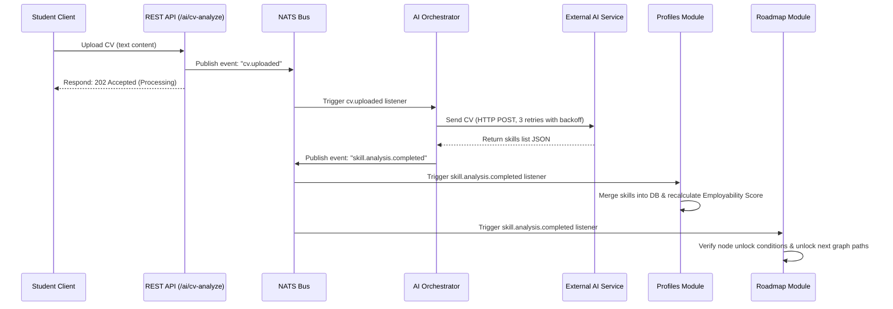
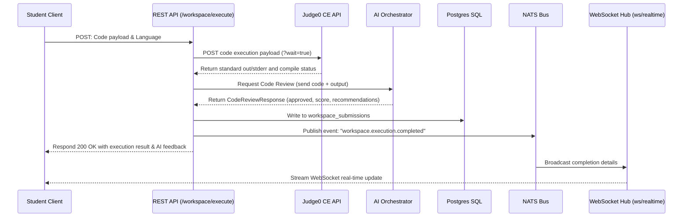

# Skillbridge Monolithic Backend

Skillbridge is a production-grade, event-driven modular monolith backend built in Go. It incorporates PostgreSQL as the primary database, Redis for token caching, session security, and rate limiting, NATS as an asynchronous event bus, and WebSockets for real-time state synchronization.

---

## 🚀 Key Features & Architectural Rules

1. **Modular Monolith Design**:
   - Each domain boundary resides under `/internal/*` and exposes decoupled interfaces.
   - Cross-domain integration is handled via **NATS Events** or constructor-injected services. Circular compile-time imports are strictly forbidden.

2. **Asynchronous Event-Driven Architecture**:
   - Heavy tasks (like CV analysis and background matching) run out-of-band via **NATS** pub/sub.
   - All state mutations are handled exclusively by the Go backend (the absolute source of truth).

3. **External AI Boundaries**:
   - AI functionality is treated entirely as an external service (via HTTP/gRPC API requests). No models are run or trained locally.
   - Request structures are validated against strict response schemas with robust exponential backoff retry wrappers.

4. **Production Security**:
   - Secure token validation using JWT with full Refresh Token Rotation verified in Redis.
   - CORS limits, Secure Security Headers, Request/Latency logging, and IP rate-limiting.

---

## 📂 Project Structure

```text
/skillbridge-backend
  ├── cmd/api/
  │     └── main.go                 # Entrypoint, Dependency Injection, Middleware, and Port Setup
  ├── internal/
  │     ├── auth/                   # JWT & Refresh Token Rotation
  │     ├── users/                  # User account management
  │     ├── profiles/               # Student skill progression & XP calculation
  │     ├── roadmap/                # Branching learning path graph (DAG)
  │     ├── workspace/              # Sandbox code runner (Judge0 Integration)
  │     ├── recruiter/              # Recruiter matching scores & postings
  │     ├── notifications/          # Async in-app & milestone alert logs
  │     ├── ai_orchestrator/        # External AI API retry wrappers & schemas
  │     ├── events/                 # NATS publisher & subscriber core client
  │     ├── ws/                     # Distributed WebSocket connection rooms & hubs
  │     ├── middleware/             # CORS, Security Headers, RBAC, & Redis Rate-limiting
  │     ├── db/                     # Postgres connection pool and self-initializing schema
  │     └── cache/                  # Redis cache connection client
  ├── migrations/
  │     └── 000001_init_schema.up.sql # Database DDL Schema
  ├── Dockerfile                    # Multi-stage production container setup
  ├── docker-compose.yml            # Automated local multi-service builder
  ├── go.mod                        # Go dependencies list
  └── README.md                     # Documentation
```

---

## ⚡ Execution Flow Details

### 1. CV Upload & Skill Extraction Flow


### 2. Sandbox Execution & Review Flow


---

## 🛣️ API Endpoints

### 🔐 Authentication
* **`POST /api/auth/register`**: Registers a user (Student / Recruiter). Automatically triggers profile setups.
* **`POST /api/auth/login`**: Authenticates credentials, returns Access & Refresh tokens.
* **`POST /api/auth/refresh`**: Generates a new Token pair by rotating the old refresh token inside Redis.

### 👤 Profile & User Data
* **`GET /api/user/profile`**: Fetches account details for current authenticated session.
* **`GET /api/profile`**: Fetches the student's profile (university, current level, XP, and skills list).
* **`PUT /api/profile`**: Updates student's school or graduation tier.

### 🗺️ Dynamic Learning Path (Roadmap)
* **`GET /api/roadmap`**: Retrieves the branching learning Graph. Node states are dynamically labeled as `locked`, `unlocked`, or `completed`.
* **`POST /api/roadmap/complete`**: Completes a specific node, triggers XP rewards, updates skill levels, and unlocks child pathways.

### 💻 Code Sandbox (Workspace)
* **`POST /api/workspace/execute`**: Compiles code inside Judge0 CE, executes unit tests, reviews code with AI, and stores history.
* **`GET /api/workspace/history`**: Lists historical submission attempts, run statuses, and AI advice.

### 🤖 AI Orchestration (REST proxies)
* **`POST /api/ai/cv-analyze`**: Accepts raw text CVs to kick off asynchronous skill analysis.
* **`POST /api/ai/skill-gap`**: Synchronously retrieves gap reports and target role pathways for user skill lists.

### 🏢 Recruiter Actions (Recruiter / Admin Only)
* **`POST /api/jobs`**: Ingests new job posting, detailing company requirements.
* **`GET /api/jobs/match?job_id=UUID`**: Automatically scores all students against the job's requirements and returns the ranked matches with analytical explanations.
* **`GET /api/jobs`**: Retrieves list of active open positions (accessible by students).

### 🔌 WebSocket
* **`GET /ws/realtime`**: Upgrades connection to WebSocket. Client receives live updates when CV processing or code executions resolve.

---

## 🛠️ Local Development

### Prerequisites
- Go installed locally (version 1.21+)
- Docker and Docker Compose installed

### Step 1: Environment Variables Setup
Create a `.env` file in the root folder containing:
```env
APP_ENV=development
APP_PORT=8080
JWT_SECRET=your-secret-key
JWT_REFRESH_SECRET=your-refresh-secret-key

DB_HOST=localhost
DB_PORT=5432
DB_USER=postgres
DB_PASSWORD=postgres
DB_NAME=skillbridge
DB_SSLMODE=disable

REDIS_ADDR=localhost:6379
NATS_URL=nats://localhost:4222

# External Integrations
JUDGE0_URL=https://judge0-ce.p.rapidapi.com
JUDGE0_KEY=your-rapidapi-key
EXTERNAL_AI_URL=https://api.external-ai.com
EXTERNAL_AI_KEY=your-ai-api-key
```

### Step 2: Spin Up Infrastructure
You can start NATS, PostgreSQL, and Redis immediately using Docker Compose:
```bash
docker-compose up -d postgres redis nats
```

### Step 3: Run the Monolith
Start the Go backend server locally:
```bash
go run cmd/api/main.go
```
The database connection pool self-initializes by checking `migrations/000001_init_schema.up.sql` and executing it automatically.

---

## 🐳 Running inside Docker

To launch the complete cluster (monolith, DB, caching, event bus) fully containerized, run:
```bash
docker-compose up --build
```
This builds our optimized multi-stage image and boots the complete API gateway on port `8080`.
  